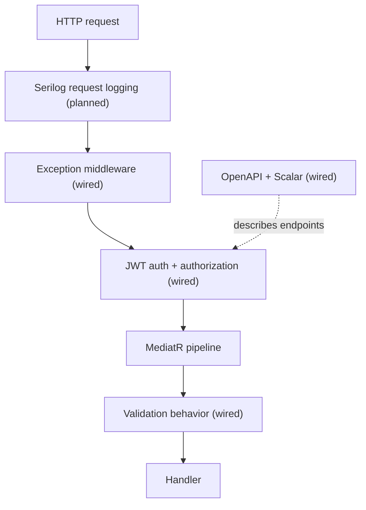

# Architecture — Cross-Cutting Concerns

Part of the architecture reference (see `architecture-layers.md` for the layering and
`architecture-request-lifecycle.md` for how a request flows). This document covers the
concerns that apply across *every* request rather than to a single feature:
authentication, validation, error handling, logging, and API documentation.

---

## Authentication & authorization — JWT *(wired)*

- **Scheme:** JWT bearer. NFR-04 requires **all** endpoints protected, except the public
  entry points (`register`, `login`, `demo`).
- **Issuing:** an `IJwtTokenGenerator` port in Application, implemented in Infrastructure,
  produces signed tokens on login. Passwords are verified against bcrypt hashes via
  `IPasswordHasher` (NFR-03).
- **Validating:** `AddAuthentication().AddJwtBearer(...)` validates the
  `Authorization: Bearer <token>` header and populates `HttpContext.User` claims; handlers
  read identity from those claims to scope data per user (FR-03).
- **Demo claims:** demo tokens carry `is_demo = true` and `demo_session_id`, used to route
  requests to the isolated demo portfolio.
- **Current state:** **wired.** `Program.cs` registers
  `AddAuthentication().AddJwtBearer(...)` with `TokenValidationParameters` from `JwtSettings`,
  and the pipeline calls `UseAuthentication()` then `UseAuthorization()`. `IJwtTokenGenerator`
  (HMAC-SHA256) and bcrypt `IPasswordHasher` are implemented in Infrastructure;
  `ICurrentUserService` (over `IHttpContextAccessor`) exposes the caller's id from the `sub`
  claim. `TransactionsController` is the first `[Authorize]` controller. Demo claims (FR-04)
  not issued yet.

## Input validation — FluentValidation *(wired)*

- A MediatR **pipeline behavior** (in `Application/Common/Behaviours/`) runs all
  registered validators before the handler executes; failures throw `ValidationException`,
  surfaced as `400` by the exception middleware.
- Validators live next to their command/query. Handlers can then assume valid input.
- **Current state:** **wired.** `Common/Behaviours/ValidationBehaviour<,>` is registered as
  an open MediatR pipeline behavior in `AddApplication()`; validators are auto-registered from
  the Application assembly (auth + transactions validators in place). Failures throw
  `ValidationException`, mapped to `400` by the exception middleware.

## Error handling — exception middleware *(wired)*

- A single middleware wraps the pipeline and converts exceptions into consistent
  **problem-details JSON** instead of leaking stack traces.
- Custom exceptions in `Domain/Exceptions/` map to status codes (e.g. not-found → 404,
  validation → 400, unauthorized → 401). This keeps `try/catch` out of controllers and
  handlers.
- **Current state:** **wired.** `API/Middleware/ExceptionHandlingMiddleware` converts
  exceptions into RFC 7807 `problem+json`: `ValidationException`→400,
  `EmailAlreadyInUseException`→409, `InvalidCredentialsException`→401, `NotFoundException`→404,
  `DomainException`→422, else 500. Custom exceptions live in `Domain/Exceptions/`.

## Object mapping — AutoMapper *(wired)*

- Entity ↔ DTO mapping is centralized in AutoMapper profiles under
  `Application/Common/Mappings/`, so handlers return DTOs and entities never cross the API
  boundary.
- **Current state:** **wired.** AutoMapper is registered from the Application assembly in
  `AddApplication()`; `Common/Mappings/TransactionProfile` is the first profile (flattens
  `Asset` ticker/name and exposes the `Currency` value object as its code string). More
  profiles land with each feature.

## Logging — Serilog *(planned)*

- **Serilog** for structured logging and request logging (`UseSerilogRequestLogging`),
  replacing the default provider, so logs carry structured properties (request path,
  status, timing, user) usable in any sink.
- **Current state:** `Serilog.AspNetCore` is referenced in the API, but `Program.cs` still
  uses the default logging config in `appsettings.json` — Serilog is **not yet wired**.

## API documentation — OpenAPI + Scalar *(wired)*

- The built-in **OpenAPI** document (`AddOpenApi()` / `MapOpenApi()`) is served at
  `/openapi/v1.json`, and **Scalar** renders interactive docs at `/scalar/v1`
  (Development only) — NFR-01.
- XML summary comments on public controller actions feed the OpenAPI document, so keeping
  them current keeps the docs current.
- **Current state:** **active** — both are mapped in `Program.cs` under
  `IsDevelopment()`. This is the one cross-cutting concern fully in place today.

---

## Where each concern is wired

All cross-cutting wiring lives in the **API composition root** (`Program.cs`), pulling in
`AddApplication()` *(wired)* and `AddInfrastructure()` *(wired)*. That keeps registration in
one place and the dependency flow one-directional (see `architecture-layers.md`).

| Concern | Layer it's defined in | Layer it's implemented/wired in | Status |
|---------|----------------------|---------------------------------|--------|
| JWT auth | Application (port) | Infrastructure + API | wired |
| Validation behavior | Application | Application + API (DI) | wired |
| Exception middleware | API | API | wired |
| AutoMapper profiles | Application | Application + API (DI) | wired |
| Serilog logging | — | API | planned |
| OpenAPI + Scalar | — | API | wired |
