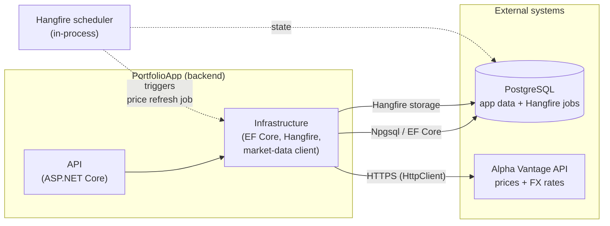

# Architecture

Architecture reference for the portfolio tracker. Pairs with `requirements.md` (the
*what*), `database-schema.md` (the data model), and `implementation-plan.md` (the order
of work). This document describes the *how* — structure, flows, and integrations.

Built up in sections. Sections marked **(planned)** describe components that are part of
the target design but not yet implemented in code.

---

## External Integrations

The backend talks to three external systems: a **PostgreSQL** database (persistence +
job storage) and the **Alpha Vantage** HTTP API (market prices and FX rates). All
outbound calls are made from the **Infrastructure** layer, behind interfaces defined in
**Application** — controllers and handlers never reach an external service directly.

### PostgreSQL — persistence

- **Role:** primary datastore for all domain data (users, portfolios, assets,
  transactions, price snapshots, FX rates, demo sessions).
- **Access:** EF Core 10 via the **Npgsql** provider. `PortfolioDbContext` and its EF
  configurations live in Infrastructure; schema changes ship as EF migrations.
- **Local dev:** runs in Docker (`docker-compose.yml` → `portfolio-db`, port 5432) with
  pgAdmin alongside. The connection string is read from user-secrets
  (`ConnectionStrings:Default`).
- **State:** ✅ implemented — `PortfolioDbContext`, configurations, DI registration, and
  the `InitialCreate` migration are in place.

### PostgreSQL — Hangfire job storage

- **Role:** the same PostgreSQL instance also backs **Hangfire** (`Hangfire.PostgreSql`),
  which persists scheduled/background job state in its own schema.
- **Jobs:** scheduled price/FX refresh (FR-09, ~every 15 min during market hours) and the
  demo-session cleanup job (FR-04, sessions older than 60 min).
- **State:** ⚠️ packages referenced in Infrastructure; jobs and wiring not yet built
  **(planned)**.

### Alpha Vantage — market data & FX

- **Role:** source of current market prices for held assets (FR-08) and current FX rates
  used to convert values into the user's base currency (FR-12).
- **Access:** an outbound HTTP client (`HttpClient`) in Infrastructure, implementing a
  market-data/FX **port interface** defined in Application. Prices fetched on a schedule
  rather than per request, then stored as `PriceSnapshot` / `FxRate` rows so portfolio
  reads stay fast (NFR-02) and resilient to API rate limits.
- **Auth:** API key supplied via configuration (user-secrets / environment), never
  hard-coded.
- **State:** ⚠️ **(planned)** — no client implemented yet.

> **Boundary rule:** external APIs are only ever called through Application-defined
> interfaces with Infrastructure implementations. Never call Alpha Vantage from a
> controller or put outbound HTTP logic in the API layer.
