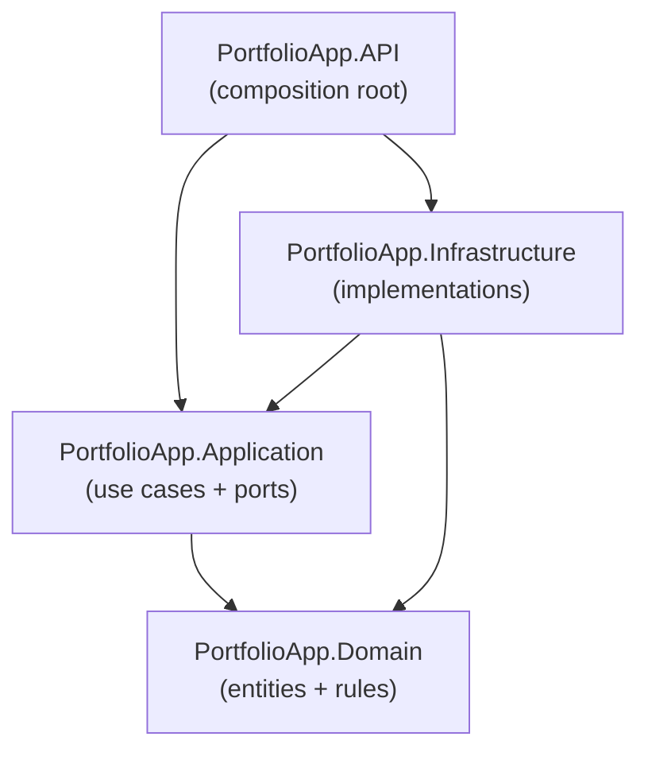

# Architecture — Layer Breakdown

Part of the architecture reference (see `architecture-external-integrations.md` for external integrations).
This document covers the **Clean Architecture** layering: the four backend projects,
their responsibilities, and the dependency direction between them.

---

## Dependency direction

The solution follows Clean Architecture with **one-directional, inward-pointing**
dependencies. Domain sits at the centre and depends on nothing; every other project
depends inward toward it. Infrastructure and API depend on Application (and Domain), but
Application never depends on them — it defines interfaces that Infrastructure implements
(Dependency Inversion).

Key consequence: **dependencies point inward**. Inner layers (Domain, Application) know
nothing about outer concerns (databases, HTTP, frameworks). Outer layers plug into inner
ones through interfaces.

---

## The four projects

### `PortfolioApp.Domain` — the core

- **Responsibility:** entities, value objects, enums, domain exceptions, and the
  interfaces the domain owns. The pure business model.
- **Folders:** `Entities`, `Enums`, `Exceptions`, `Interfaces`.
- **Dependencies:** **none** — no NuGet packages, no other project. This is what keeps the
  business rules framework-agnostic and testable in isolation.
- **Examples:** the 7 entities (`User`, `Portfolio`, `DemoSession`, `Asset`,
  `Transaction`, `PriceSnapshot`, `FxRate`) plus their enums.

### `PortfolioApp.Application` — use cases & ports

- **Responsibility:** orchestrates business operations as use cases. Defines the **ports**
  (interfaces) that outer layers implement — e.g. repositories, the password hasher, the
  JWT generator, the market-data/FX client.
- **Folders:** `Features` (CQRS commands/queries + handlers + validators, one feature per
  folder), `DTOs`, `Common` (pipeline behaviors, AutoMapper profiles), `Interfaces`
  (ports).
- **Patterns / packages:** **MediatR** (CQRS request/handler), **FluentValidation**
  (input rules via a pipeline behavior), **AutoMapper** (entity ↔ DTO).
- **Dependencies:** Domain only.

### `PortfolioApp.Infrastructure` — implementations

- **Responsibility:** concrete implementations of Application ports. Everything that talks
  to the outside world: persistence, background jobs, outbound HTTP.
- **Contents:** `PortfolioDbContext` + EF configurations + migrations (EF Core 10 /
  **Npgsql**), Hangfire (PostgreSQL storage) for scheduled jobs, and the Alpha Vantage
  market-data/FX client **(planned)**.
- **Dependencies:** Application and Domain.

### `PortfolioApp.API` — composition root

- **Responsibility:** the ASP.NET Core 10 Web API. Thin controllers, JWT bearer auth,
  Serilog logging, global exception middleware, OpenAPI/Scalar. This is the **only**
  project that references both Application and Infrastructure, and where DI is wired
  together.
- **Folders:** `Controllers`, `Extensions` (DI registration), `Middleware`, plus
  `Program.cs`.
- **Dependencies:** Application and Infrastructure.

---

## Why this layout

- **Testability:** Domain and Application have no infrastructure dependencies, so use-case
  logic is unit-testable with mocked ports (NSubstitute) — no database required.
- **Swappability:** the database, market-data provider, or auth scheme can change by
  replacing an Infrastructure implementation, without touching business logic.
- **Single composition root:** wiring lives only in API, so dependencies flow in one
  direction and the inner layers stay clean.

> **Rule:** when adding a feature, flow inward-out: Domain entity/rule → Application
> command/query + handler + validator (+ any new port interface) → Infrastructure
> implementation → API endpoint. No business logic in controllers or EF configurations.
