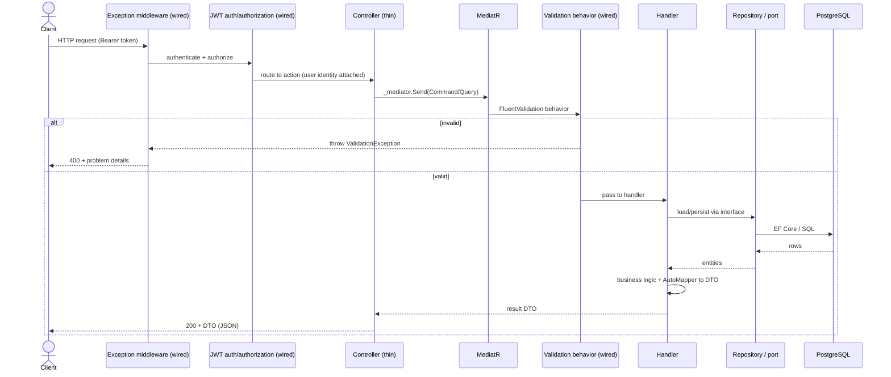

# Architecture — Request Lifecycle

Part of the architecture reference (see `architecture-layers.md` for the layering and
`../database-schema.md` for the entities and their relationships). This document traces a single HTTP
request through the backend: from the controller, across the **MediatR CQRS pipeline**,
into a handler, out to Infrastructure, and back as a response.

---

## End-to-end flow

---

## Stage by stage

### 1. Exception-handling middleware *(wired)*
The outermost stage. `ExceptionHandlingMiddleware` wraps the whole pipeline so any domain
or validation exception is translated into a consistent RFC 7807 `problem+json` response
instead of leaking a stack trace. Maps custom `Domain/Exceptions` types to status codes:
`ValidationException`→400, `EmailAlreadyInUseException`→409, `InvalidCredentialsException`→401,
`NotFoundException`→404, `DomainException`→422, else 500. Keeps error handling out of
controllers and handlers.

### 2. Authentication & authorization *(wired)*
JWT bearer authentication validates the `Authorization: Bearer <token>` header and
attaches the user identity (claims) to `HttpContext`; handlers read it via
`ICurrentUserService` to scope data per user (FR-03). NFR-04 requires **all** endpoints
JWT-protected (except `register`/`login`/`demo`) — `TransactionsController` is the first
`[Authorize]` controller. Demo claims (`is_demo`, `demo_session_id`) are defined in the
design but not issued yet (FR-04). `Program.cs` registers the JWT bearer scheme and calls
`UseAuthentication()` then `UseAuthorization()`.

### 3. Controller (thin)
The action does almost nothing: bind the request, build a MediatR `Command`/`Query`, call
`_mediator.Send(...)`, return the result. **No business logic, no data access.** It also
reads the caller's identity from claims to pass ownership context into the request. Public
controller actions carry XML summary comments (feeds OpenAPI/Scalar).

### 4. MediatR dispatch
`Send` locates the single handler registered for that request type (CQRS: one
command/query → one handler). Requests live in
`Application/Features/<Feature>/`, one class per command or query.

### 5. Validation behavior *(wired)*
A MediatR **pipeline behavior** runs registered FluentValidation validators for the
request before it reaches the handler. On failure it throws a `ValidationException`
(caught by the middleware in stage 1 → 400). Validators live next to their command. This
centralizes input validation so handlers can assume valid input.

### 6. Handler
The use case itself. Orchestrates the operation: load entities through **Application port
interfaces** (repositories, etc.), apply domain rules (e.g. weighted-average-cost P&L),
and never touches EF or HTTP types directly. Depends only on abstractions — which is what
makes it unit-testable with mocked ports.

### 7. Infrastructure (ports → adapters)
The interfaces the handler calls are implemented in Infrastructure: EF Core repositories
over `PortfolioDbContext`/PostgreSQL, the JWT generator, the password hasher, the Alpha
Vantage client. This is the only place that talks to the database or external services.

### 8. Mapping & response
The handler maps domain entities to a **DTO** with AutoMapper (profiles in
`Application/Common/Mappings/`) and returns it. The controller returns that DTO; ASP.NET
serializes it to JSON. Entities never cross the API boundary directly.

---

## Why the pipeline is shaped this way

- **Thin controllers + MediatR** keep HTTP concerns and business logic separate, and make
  each use case an isolated, testable unit.
- **Cross-cutting via behaviors/middleware** (validation, exceptions, logging) means those
  concerns are written once and apply to every request, not copy-pasted per endpoint.
- **Ports & adapters** keep handlers dependent on interfaces only, so the database or an
  external provider can change without touching use-case code.
- **DTOs at the edge** prevent leaking the domain model (and EF navigation graphs) to
  clients.

See `architecture-cross-cutting.md` for auth, logging (Serilog, still planned), exception
middleware, and OpenAPI/Scalar in more depth.
