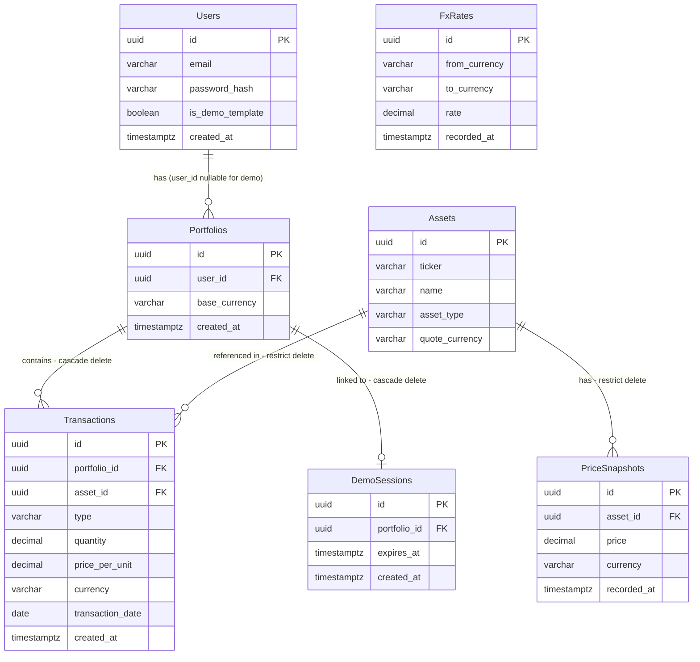

# PortfolioApp - Database Schema

## Overview

- Database: PostgreSQL
- ORM: Entity Framework Core 9
- All primary keys: `UUID` (Guid in C#)
- All timestamps: `timestamptz` (UTC)
- Monetary values: `decimal(18,8)` - stored in original currency, never converted
- String identifiers (ticker, currency): `varchar` with max length

---

## Tables

### Users

Stores registered users and the demo portfolio template.

| Column             | Type           | Constraints             | Notes                                      |
|--------------------|----------------|-------------------------|--------------------------------------------|
| id                 | uuid           | PK                      | Guid.NewGuid()                             |
| email              | varchar(256)   | NOT NULL, UNIQUE        | Null for demo template row                 |
| password_hash      | varchar(512)   | NOT NULL                | bcrypt hash                                |
| is_demo_template   | boolean        | NOT NULL, DEFAULT false | True for exactly one seed row              |
| created_at         | timestamptz    | NOT NULL, DEFAULT now() |                                            |

**Indexes:** `IX_Users_Email` (unique, filtered: email IS NOT NULL)

---

### DemoSessions

One row per active demo login. Portfolio is isolated per session.

| Column       | Type        | Constraints             | Notes                              |
|--------------|-------------|-------------------------|------------------------------------|
| id           | uuid        | PK                      |                                    |
| portfolio_id | uuid        | NOT NULL, FK(Portfolios)| Cascade delete                     |
| expires_at   | timestamptz | NOT NULL                | created_at + 60 minutes            |
| created_at   | timestamptz | NOT NULL, DEFAULT now() |                                    |

**Indexes:** `IX_DemoSessions_ExpiresAt` (for Hangfire cleanup job)
**Cascade:** deleting DemoSession deletes the linked Portfolio (and its Transactions)

---

### Portfolios

One portfolio per user. Demo sessions get a temporary copy.

| Column        | Type         | Constraints             | Notes                                    |
|---------------|--------------|-------------------------|------------------------------------------|
| id            | uuid         | PK                      |                                          |
| user_id       | uuid         | FK(Users)               | NULL for demo session portfolios         |
| base_currency | varchar(3)   | NOT NULL                | ISO 4217 e.g. PLN, USD, EUR              |
| created_at    | timestamptz  | NOT NULL, DEFAULT now() |                                          |

**Indexes:** `IX_Portfolios_UserId`

---

### Assets

Lookup table of known tickers. Shared across all portfolios.

| Column         | Type        | Constraints      | Notes                              |
|----------------|-------------|------------------|------------------------------------|
| id             | uuid        | PK               |                                    |
| ticker         | varchar(20) | NOT NULL, UNIQUE | e.g. AAPL, VWCE, MSFT             |
| name           | varchar(256)| NOT NULL         | e.g. Apple Inc.                    |
| asset_type     | varchar(10) | NOT NULL         | STOCK or ETF                       |
| quote_currency | varchar(3)  | NOT NULL         | Currency the asset is quoted in    |

**Indexes:** `IX_Assets_Ticker` (unique)

---

### Transactions

Core table. Every buy/sell operation on a portfolio.

| Column           | Type           | Constraints              | Notes                                  |
|------------------|----------------|--------------------------|----------------------------------------|
| id               | uuid           | PK                       |                                        |
| portfolio_id     | uuid           | NOT NULL, FK(Portfolios) | Cascade delete                         |
| asset_id         | uuid           | NOT NULL, FK(Assets)     | Restrict delete                        |
| type             | varchar(4)     | NOT NULL                 | BUY or SELL                            |
| quantity         | decimal(18,8)  | NOT NULL                 | Always positive                        |
| price_per_unit   | decimal(18,8)  | NOT NULL                 | In transaction currency                |
| currency         | varchar(3)     | NOT NULL                 | ISO 4217, currency of price_per_unit   |
| transaction_date | date           | NOT NULL                 | Date of the trade (not created_at)     |
| created_at       | timestamptz    | NOT NULL, DEFAULT now()  |                                        |

**Indexes:**
- `IX_Transactions_PortfolioId`
- `IX_Transactions_AssetId`
- `IX_Transactions_PortfolioId_AssetId` (composite, for per-asset queries)
- `IX_Transactions_TransactionDate`

---

### PriceSnapshots

Historical price data fetched from Alpha Vantage. Used for charts and P&L history.

| Column      | Type          | Constraints          | Notes                               |
|-------------|---------------|----------------------|-------------------------------------|
| id          | uuid          | PK                   |                                     |
| asset_id    | uuid          | NOT NULL, FK(Assets) | Restrict delete                     |
| price       | decimal(18,8) | NOT NULL             |                                     |
| currency    | varchar(3)    | NOT NULL             | Same as Assets.quote_currency       |
| recorded_at | timestamptz   | NOT NULL             | Timestamp of the fetched price      |

**Indexes:**
- `IX_PriceSnapshots_AssetId_RecordedAt` (composite, for time-range queries)

---

### FxRates

Historical FX rates fetched from Alpha Vantage. Used to convert asset values to base currency.

| Column        | Type          | Constraints | Notes                          |
|---------------|---------------|-------------|--------------------------------|
| id            | uuid          | PK          |                                |
| from_currency | varchar(3)    | NOT NULL    | e.g. USD                       |
| to_currency   | varchar(3)    | NOT NULL    | e.g. PLN                       |
| rate          | decimal(18,8) | NOT NULL    |                                |
| recorded_at   | timestamptz   | NOT NULL    |                                |

**Indexes:**
- `IX_FxRates_FromTo_RecordedAt` (composite on from_currency, to_currency, recorded_at)

---

## Relationships



---

## Business Logic Notes

### P&L Calculation (Weighted Average Cost)
Average cost per unit for a given asset in a portfolio:

```
avg_cost = SUM(quantity * price_per_unit) for all BUY transactions
         / SUM(quantity) for all BUY transactions
```

Unrealized P&L:
```
unrealized_pl = (current_price - avg_cost) * current_quantity
```

All values converted to base_currency using the latest FxRate before display.

### Demo Session Flow
1. User hits POST /auth/demo
2. Copy all Transactions from the demo template Portfolio to a new Portfolio (user_id = NULL)
3. Insert DemoSession row with expires_at = now() + 60 min
4. Return JWT with claims: { is_demo: true, demo_session_id: <id>, portfolio_id: <id> }
5. Hangfire job runs every 5 minutes: DELETE FROM DemoSessions WHERE expires_at < now()
   - Cascade deletes Portfolio and its Transactions automatically

### Price Refresh (Hangfire)
- Job runs every 15 minutes during market hours (Mon-Fri 09:30-16:00 ET)
- Fetches latest price for each distinct ticker in Transactions
- Fetches FX rates for all currency pairs needed (asset currency -> each user's base_currency)
- Inserts new rows into PriceSnapshots and FxRates (never updates existing rows)

---

## EF Core Configuration Notes

- Use `HasColumnType("decimal(18,8)")` for all decimal columns
- Use `IsRequired()` and `HasMaxLength()` on all string columns
- Use `HasConversion<string>()` for enums (TransactionType: BUY/SELL, AssetType: STOCK/ETF)
- Soft deletes: not used - hard delete only (demo sessions cleaned up by Hangfire)
- All DateTime properties mapped as `timestamptz` via Npgsql: `AppContext.SetSwitch("Npgsql.EnableLegacyTimestampBehavior", false)`